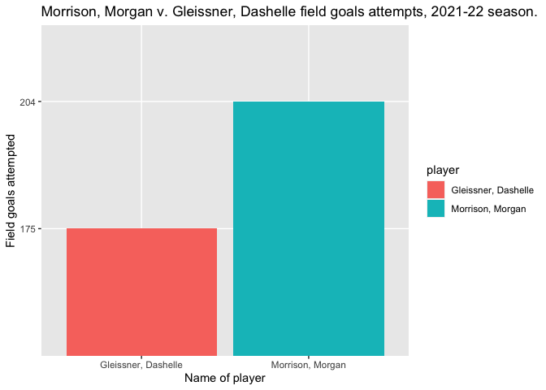

<!-- README.md is generated from README.Rmd. Please edit that file -->

# wetried

Names: Chi Qiu, Meaghan Brennan, and Emma Gardecki

<!-- badges: start -->

[](https://lifecycle.r-lib.org/articles/stages.html#experimental)
[](https://CRAN.R-project.org/package=wetried2)

<!-- badges: end -->

## Purpose

The purpose of `wetried2` package is to be a Smith College basketball
version of the nbastatr package, but in a simpler form. It uses the
season totals as provided on the Smith Athletics website and will all
for users to calculate advanced stats on their own, such as TS%, and
provide visualizations for analysis.

## Target Audience

Users who may be interested in this package would be anyone interested
in Smith College’s basketball team, as well as anyone interested in
sports analytics and specifically basketball analytics. This package
also provides a useful way for coaches to learn more about the team and
how to improve it.

## Installation

You can install `wetried2` from [CRAN](https://cran.r-project.org/)
with:

``` r
#install.packages("wetried2")
```

You can install the development version of `wetried2` from
[GitHub](https://github.com/) with:

``` r
# install.packages("devtools")
devtools::install_github("chiqiu23/wetried")
```

## Load

``` r
library(wetried2) 
#> Loading required package: ggplot2
#> Warning: package 'ggplot2' was built under R version 4.2.2
#> Loading required package: dplyr
#> 
#> Attaching package: 'dplyr'
#> The following objects are masked from 'package:stats':
#> 
#>     filter, lag
#> The following objects are masked from 'package:base':
#> 
#>     intersect, setdiff, setequal, union
#> Loading required package: stringr
```

## Available Datasets

-   `smith_wbb_data`: dataset of Smith College Women Basketball Games
    for 2010-2022 season (with exception for the 2019-2020 season that
    was disrupted by the Covid-19 Pandemic)

## Available functions

-   `TS_percentage()`: calculate TS% or True Shooting Percentage from
    the Smith WBB dataset.
-   `perform_players()`: compare field goals attempted for two selected
    players across one season

## Example: 2010-2022 Cumulative Statistics for Smith College Women Basketball Game

``` r
head(smith_wbb_data)
#> # A tibble: 6 × 27
#>   number player     gp    gs   tot   avg   fgm   fga fg_pe…¹  x3pt x3pta x3pt_…²
#>   <chr>  <chr>   <dbl> <dbl> <dbl> <dbl> <dbl> <dbl>   <dbl> <dbl> <dbl>   <dbl>
#> 1 11     "Picku…    28    28   697  24.9   119   226   0.527     5    12   0.417
#> 2 14     "Ruffn…    28    28   769  27.5   127   260   0.488    22    55   0.4  
#> 3 22     "Morri…    28     2   451  16.1   127   204   0.623     0     0   0    
#> 4 05     "Yamad…    28     6   579  20.7    72   192   0.375    39   120   0.325
#> 5 25     "Clair…    25    21   542  21.7    69   189   0.365    34   102   0.333
#> 6 10     "Gleis…    28    28   754  26.9    67   175   0.383    26    82   0.317
#> # … with 15 more variables: ftm <dbl>, fta <dbl>, ft_percent <dbl>, pts <dbl>,
#> #   avg_2 <dbl>, off <dbl>, def <dbl>, tot_2 <dbl>, avg_3 <dbl>, pf <dbl>,
#> #   ast <dbl>, to <dbl>, stl <dbl>, blk <dbl>, season <chr>, and abbreviated
#> #   variable names ¹​fg_percent, ²​x3pt_percent
```

### Efficiency Calculation

``` r
TS_percentage(input_player = "Bondi, Lauren", input_season = "2018-19")
#> [1] 56.037
```

### Assist to Turnover Ratio Calculation

``` r
ast_turnover_ratio(input_player = "Pickunka, Katelyn", input_season = "2021-22")
#> [1] 0.462963
```

### Data Visualization

``` r
perform_players(player_num1 = 10, player_num2 = 22, input_season = "2021-22")
```



## Project Proposals for Phase III

In the project phase III, we will add more Smith College basketball
team’s data and calculate more advanced stats and any important numbers
that are useful for evaluating the performance of a basketball game.
Additionally, we will build more functions that analyze and visualize
the important stats we generated. For the name of the package, we will
find a better name by the submission of phase III.

## Contributors

-   [Chi Qiu](https://github.com/chiqiu23)

-   [Meaghan Brennan](https://github.com/teenyss)

-   [Emma Gardecki](https://github.com/emmagardecki)
